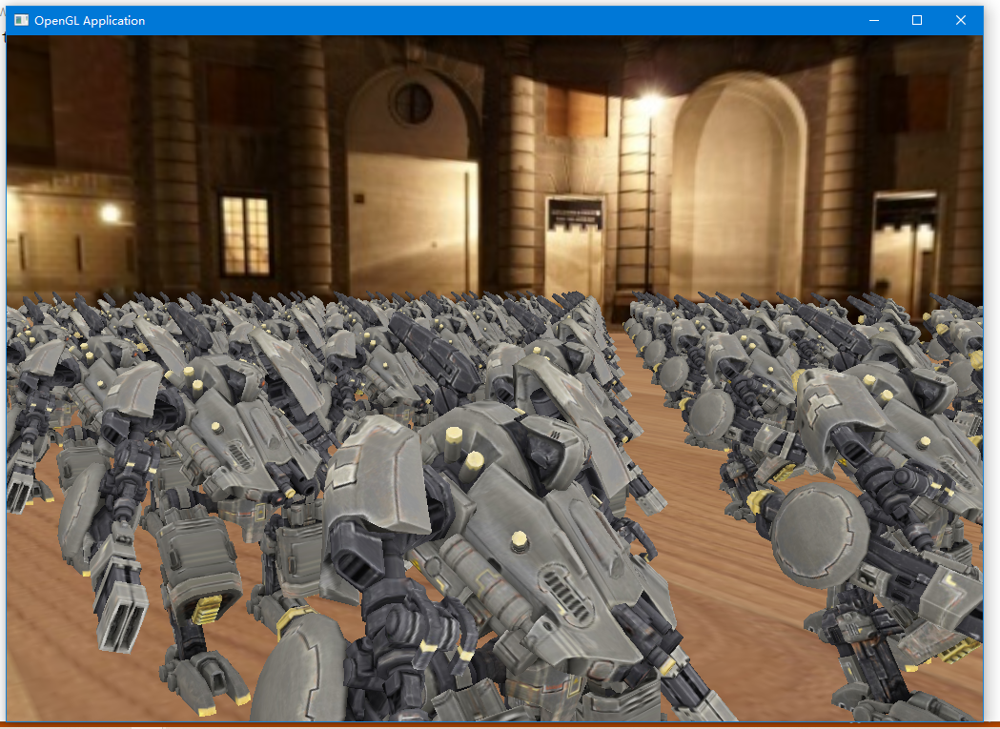
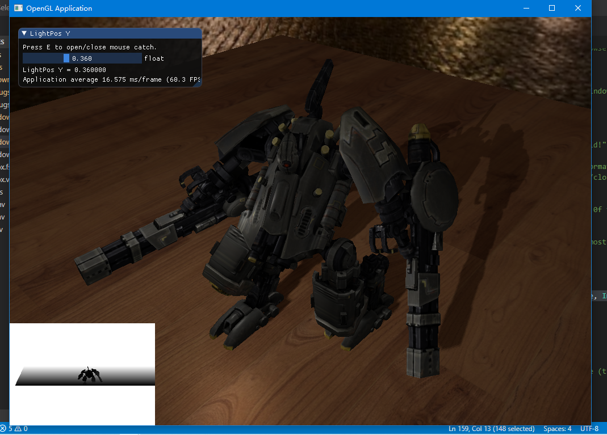

### [01 - Model Loader](https://github.com/HongHuaFu/OpenGL-Graphics/tree/f7aede2a611c6aa22a9f5f948517abc076766b53)

### [02 - Stencil Outline](https://github.com/HongHuaFu/OpenGL-Graphics/tree/c85cf06c6c37be7db69272443451965ab48190c4)

### [03 - SkyBox](https://github.com/HongHuaFu/OpenGL-Graphics/tree/fae6c66a0d2fb77d2c969a94111de16e14d2d24f)

### [04 - Instances](https://github.com/HongHuaFu/OpenGL-Graphics/tree/3cf02277a8eba2b6006447f9126398660112e17e)

### [05 - ShadowMapping]()

### [06 - Deferred Shading]()

