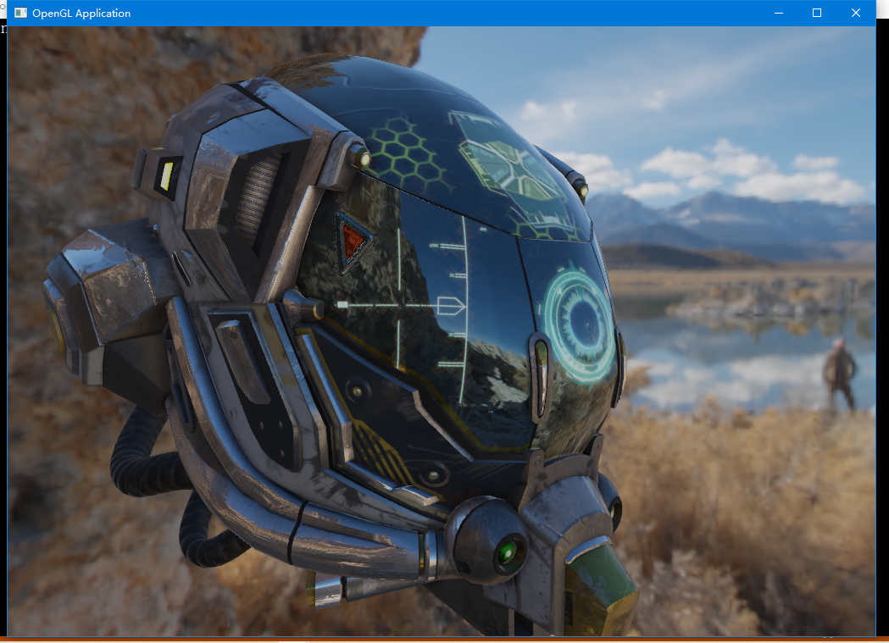

### [01 - Model Loader](https://github.com/HongHuaFu/OpenGL-Graphics/tree/f7aede2a611c6aa22a9f5f948517abc076766b53)

### [02 - Stencil Outline](https://github.com/HongHuaFu/OpenGL-Graphics/tree/c85cf06c6c37be7db69272443451965ab48190c4)

### [03 - SkyBox](https://github.com/HongHuaFu/OpenGL-Graphics/tree/fae6c66a0d2fb77d2c969a94111de16e14d2d24f)

### [04 - Instances](https://github.com/HongHuaFu/OpenGL-Graphics/tree/3cf02277a8eba2b6006447f9126398660112e17e)

### [05 - ShadowMapping]()

### [06 - Deferred Shading]()

### [07-SSAO]()

### [08- Bloom]()

### [09- Normal && AO]()

### [10- PBR]()

一些PBR资料：

**概念**：

- [Physically Based Rendering](http://www.codinglabs.net/article_physically_based_rendering.aspx)

- [Learn OpenGL](https://learnopengl-cn.github.io/07 PBR/01 Theory/)

- [PBRT-E5.4-辐射学（Radiometry）](https://zhuanlan.zhihu.com/p/56020885)

- [brdf为什么要定义为一个单位是sr-1的量？](https://www.zhihu.com/question/28476602)

- [基于物理着色：BRDF](https://zhuanlan.zhihu.com/p/21376124)

- [基于物理的渲染（PBR）白皮书](https://zhuanlan.zhihu.com/p/53086060)

- [THE PBR GUIDE](https://academy.substance3d.com/courses/the-pbr-guide-part-1)

  

  **实现**：

- [Learn OpenGL](https://learnopengl-cn.github.io/07 PBR/01 Theory/)

- https://github.com/JoshuaSenouf/gl-engine

- https://github.com/Angelo1211/HybridRenderingEngine

- https://github.com/Nadrin/PBR

  

**数学**：

- [如何通俗易懂地解释卷积？](https://www.zhihu.com/question/22298352)
- [如何通俗地理解卷积？](https://www.matongxue.com/madocs/32/)
- [计算机图形学的光学基础&BRDF公式的推导](https://www.bilibili.com/read/cv548776/)

